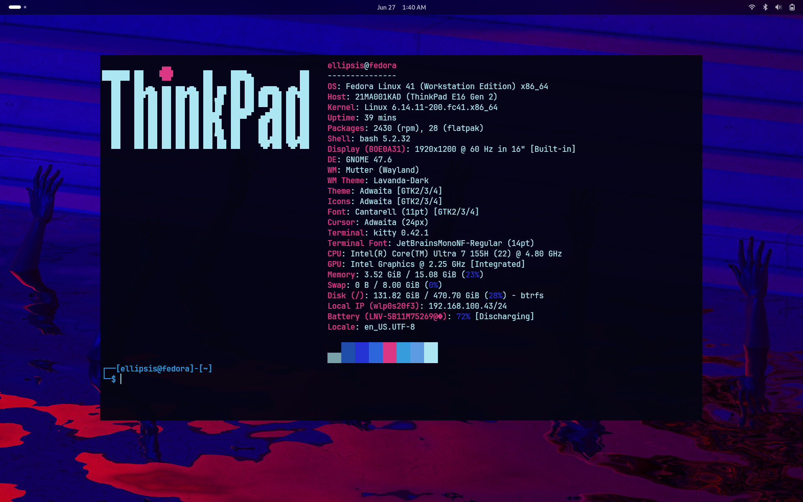
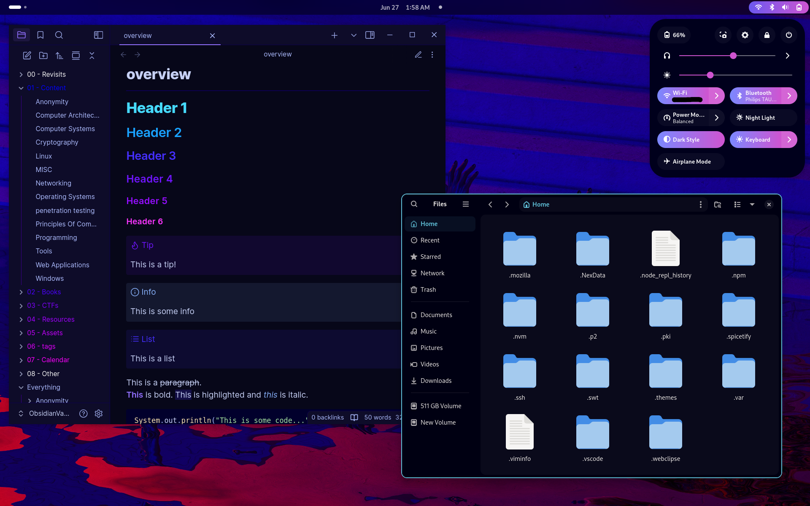
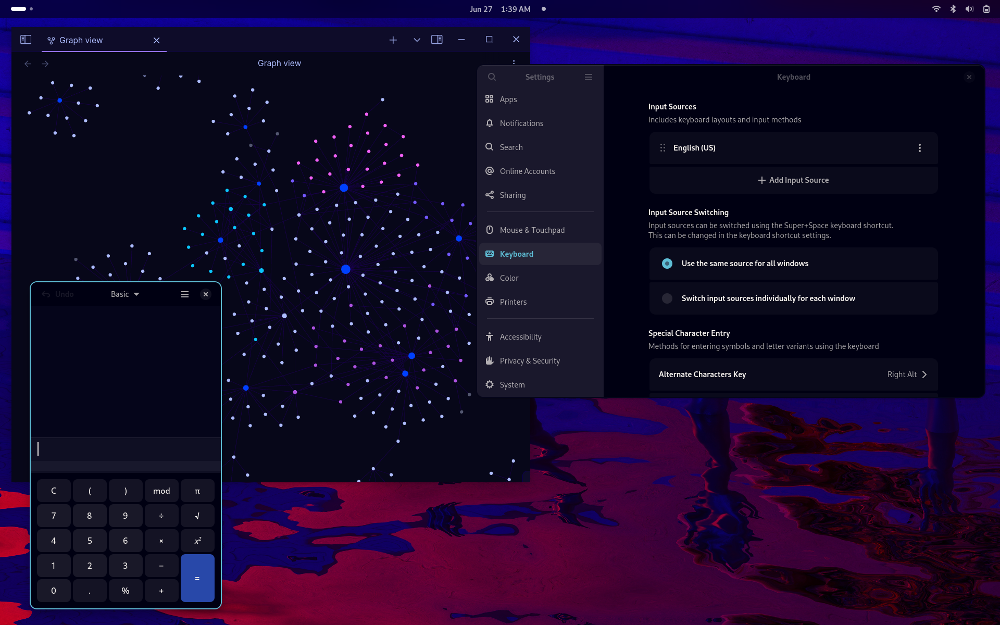
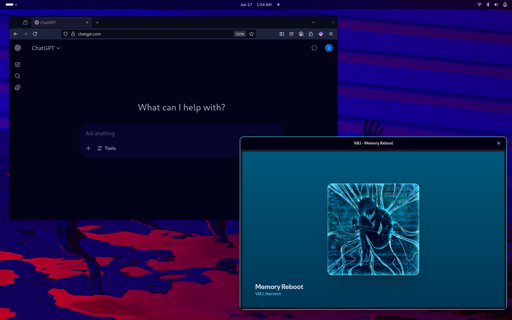
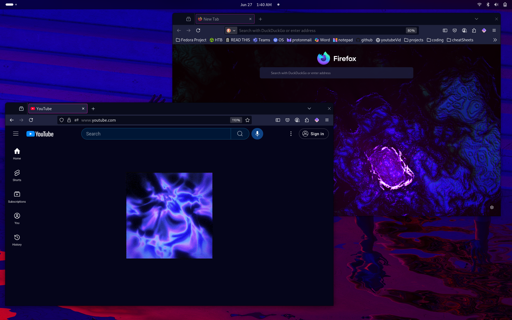

## Theme

  
  
  
  

### Dependencies
- Pywal (https://github.com/dylanaraps/pywal)
- Kitty (https://sw.kovidgoyal.net/kitty/)
- Ls Deluxe (https://github.com/lsd-rs/lsd)
- Spicetify (https://spicetify.app/)
- Ulauncher (https://github.com/Ulauncher/Ulauncher)
- Fastfetch (https://github.com/fastfetch-cli/fastfetch)
- Nerd Fonts (https://github.com/ryanoasis/nerd-fonts)
- Stylus Firefox extension
- Gnome Tweaks
- Gnome Extension Manager
